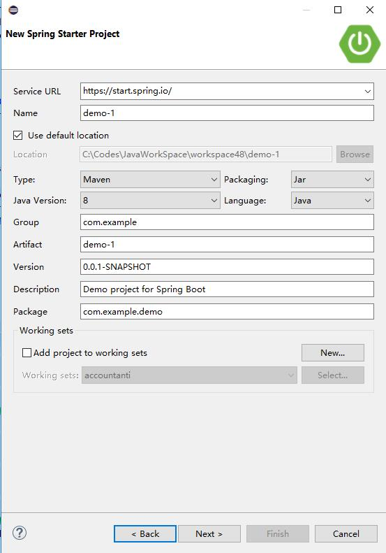
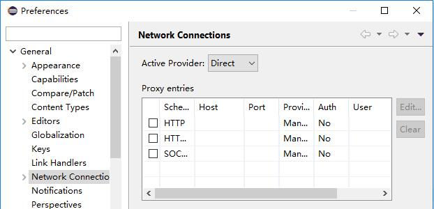

## Spring Initializr

`Spring Initializr` 从本质上来说就是一个Web应用程序，它能为你生成`Spring Boot`项目结构。  

虽然不能生成应用程序代码，但它能为你提供一个基本的项目结构，以及一个用于构建代码的 Maven 或 Gradle构建说明文件。

你只需要写应用程序的代码就好了。

### Spring Initializr 用法

- 通过Web界面使用。
- 通过Spring Tool Suite使用。
- 通过IntelliJ IDEA使用。
- 使用Spring Boot CLI使用。

#### 使用Spring Initializr的Web界面

用浏览器打开 [http://start.spring.io](http://start.spring.io) 。

#### 在Spring Tool Suite里创建Spring Boot项目

若没有 Spring Tool Suite，请[安装 Spring Tool Suite](1.3安装spring-tool-suite插件.md)。

要在 Spring Tool Suite 里创建新的 Spring Boot 应用程序，在 File 菜单里选中 New > project > Spring Starter
Project菜单项。



##### 异常处理

若提示 “SunCertPathBuilderException: unable to find valid certification path to requested target”，可打开Window -> Preferences -> Network Connections，修改 Active Provider 为Direct，应用并退出。



##### 注意事项

Spring Tool Suite 的Spring Starter Project对话框，其实是把项目生成的工作委托给 http://start.spring.io 上的Spring Initializr来做的，因此必须联网才能使用这一功能。

#### 在Spring Boot CLI里使用Initializr

Spring Boot CLI 包含了一个 init 命令。 

init 命令最简单的用法就是创建Spring Boot项目的基线：

```powershell
$ spring init
Using service at https://start.spring.io
Content saved to 'demo.zip'
```

### 目录结构

```
C:.
│  .gitignore
│  HELP.md
│  mvnw
│  mvnw.cmd
│  pom.xml
│
├─.mvn
│  └─wrapper
│          maven-wrapper.jar
│          maven-wrapper.properties
│          MavenWrapperDownloader.java
│
└─src
    ├─main
    │  ├─java
    │  │  └─com
    │  │      └─example
    │  │          └─jueee
    │  │              └─test
    │  │                      TestApplication.java
    │  │
    │  └─resources
    │          application.properties
    │
    └─test
        └─java
            └─com
                └─example
                    └─jueee
                        └─test
                                TestApplicationTests.java
```

