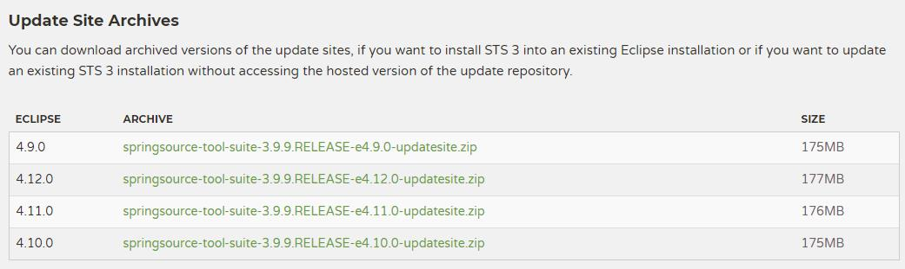
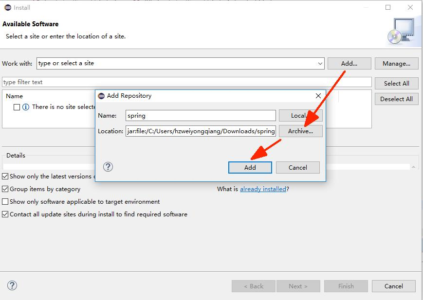
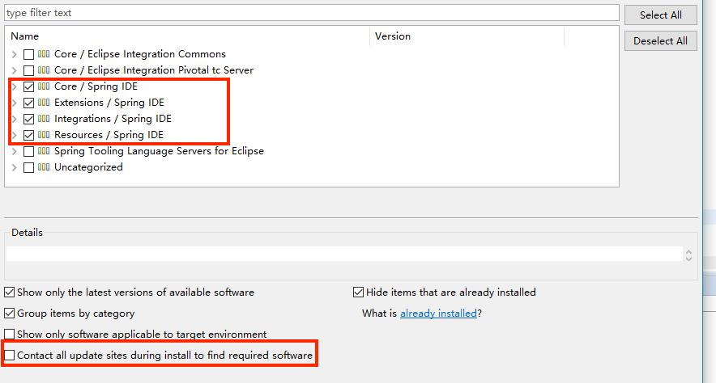
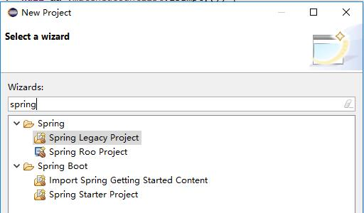

## 安装 spring-tool-suite 插件

#### 下载

去官网 [https://spring.io/tools3/sts/all](<https://spring.io/tools3/sts/all>) 下载对应的eclipse版本的插件：

#### 选择

打开 eclipse-->help-->install new software，点击Add，然后选择刚刚下载好的安装包，然后点击OK。

#### 安装

勾选下面的四个插件，同时取消自动更新。紧接着，一路点击next即可。

#### 重启

重启eclipse，spring-tool-suite 插件安装成功。

