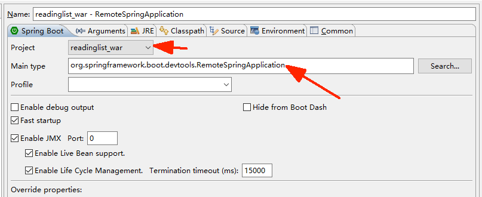
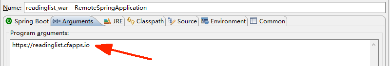

## Spring Boot开发者工具

Spring Boot 1.3引入了一组新的开发者工具，可以让你在开发时更方便地使用Spring Boot。

包括如下功能：

- **自动重启**：当Classpath里的文件发生变化时，自动重启运行中的应用程序。
- **LiveReload支持**：对资源的修改自动触发浏览器刷新。
- **远程开发**：远程部署时支持自动重启和LiveReload。
- **默认的开发时属性值**：为一些属性提供有意义的默认开发时属性值。

添加开发工具：

```xml
<dependency>
    <groupId>org.springframework.boot</groupId>
    <artifactId>spring-boot-devtools</artifactId>
</dependency>
```

当应用程序以完整打包好的JAR或WAR文件形式运行时，开发者工具会被禁用，所以没有必要在构建生产部署包前移除这个依赖。

### 自动重启

在激活了开发者工具后，Classpath里对文件做任何修改都会触发应用程序重启。

有些Classpath里的资源变更后不需要重启应用程序。

像Thymeleaf这样的视图模板可以直接
编辑，不用重启应用程序。

在 `/static` 或 `/public` 里的静态资源也不用重启应用程序，所以Spring Boot
开发者工具会在重启时排除掉如下目录：`/META-INF/resources`、`/resources`、`/static`、`/public` 和
`/templates`。

#### 覆盖默认的重启排除目录

可以设置 `spring.devtools.restart.exclude` 属性来覆盖默认的重启排除目录。

只排除/static和/templates目录：

```yaml
spring:
  devtools:
    restart:
      exclude: /static/**,/templates/**
```

#### 关闭自动重启

如果想彻底关闭自动重启，可以将 spring.devtools.restart.enabled 设置
为 false ：

```yaml
spring:
  devtools:
    restart:
      enabled: false
```

#### 设置触发文件

可以设置一个触发文件，必须修改这个文件才能触发重启。

例如，在修改名为 .trigger
的文件前你都不希望执行重启，只需设置属性：

```yaml
spring:
  devtools:
    restart:
      trigger-file: .trigger
```

### LiveReload

Spring Boot的开发者工具集成了 [LiveReload](http://livereload.com)，可以消除刷新的步骤。

激活开发者工具后，Spring Boot会启动一个内嵌的LiveReload服务器，在资源文件变化时会触发浏览器刷新。

你要做的就是在浏览器里安装 LiveReload 插件。

禁用内嵌的 LiveReload 服务器：

```yaml
spring:
  devtools:
    livereload:
      enabled: false
```

### 远程开发

设置一个远程安全码来开启远程开发功能。

有了这个属性后，运行中的应用程序就会启动一个服务器组件以支持远程开发。

它会监听接
受变更的请求，可以重启应用程序或者触发浏览器刷新。

```yaml
spring:
  devtools:
    remote:
      secret: myappsecret
```

为了使用这个远程服务器，你需要在本地运行远程开发工具的客户端。

这个远程客户端是一
个类，类名是 `org.springframework.boot.devtools.RemoteSpringApplication`。

它会运行在IDE里，要求提供一个参数，告知远程应用程序部署在哪里。

#### 开启远程客户端
可以通过如下步骤开启远
程客户端。

1. 选择Run > Run Configurations菜单项。
2. 创建一个新的Java Application运行配置。
3. 在Project里选中Reading List项目（可以键入项目名或者点击Browse按钮找到这个项目）。
4. 在Main Class里键入 `org.springframework.boot.devtools.RemoteSpringApplication`。
5. 切换到Arguments标签页，在Program Arguments里键入 https://readinglist.cfapps.io 。





客户端启动后，就可以在IDE里修改应用程序了。

在检测到变动后，这些修改点会被推送到
远端并加以应用。

如果修改的内容涉及呈现的Web资源（比如样式表或JavaScript），LiveReload
还会触发浏览器刷新。

### 默认的开发时属性

默认情况下，Spring Boot会为其支持的各种视图模板（Thymeleaf、Freemarker、Velocity、
Mustache和Groovy模板）开启缓存选项。

但如果存在 Spring Boot 的开发者工具，这些缓存就会禁用。

这就是说在开发者工具激活后，如下属性会设置为 false 。

- `spring.thymeleaf.cache`
- `spring.freemarker.cache`
- `spring.velocity.cache`
- `spring.mustache.cache`
- `spring.groovy.template.cache`

这样一来，就不用在开发时禁用它们了。

### 全局配置开发者工具

在使用开发者工具时，你通常会在多个项目里使用相同的设置。

相比
在每个项目里重复开发者工具配置，对开发者工具做全局配置显得更方便一些。

要实现这个目的，可以在你的主目录（home directory）里创建一个名为 `.spring-boot-devtools.
properties`的文件。（请注意，文件名用“.”开头。）在那个文件里，你可以设置希望在多个项目
里共享的各种开发者工具属性。

例如，假设你想把触发文件的名称设置为.trigger，在所有Spring Boot项目里禁用LiveReload。

你可以创建一个.spring-boot-devtools.properties文件，包含如下内容：

```properties
spring.devtools.restart.trigger-file=.trigger
spring.devtools.livereload.enabled=false
```

要是你想覆盖这些配置，可以在每个项目的 application.properties 或 application.yml 文件里设置
特定于每个项目的属性。