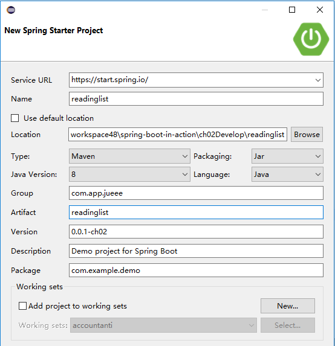
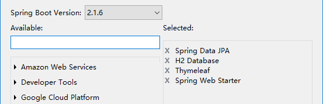
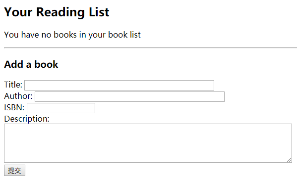
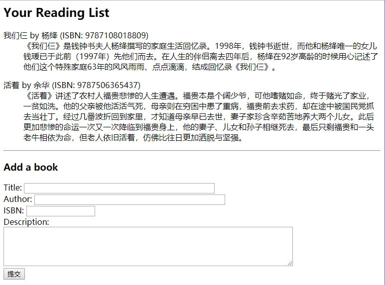

## 开发第一个应用程序

### 创建项目

使用 Spring Initializr 开始初始化一个项目：



- 用 Spring MVC 来处理Web请求
- 用 Thymeleaf 来定义Web视图
- 用 Spring Data JPA 来把阅读列表持久化到数据库里
- 用嵌入式的 H2 数据库



### 查看初始化的新项目

#### 目录结构

```powershell
readinglist/src
├─main
│  ├─java
│  │  └─com
│  │      └─example
│  │          └─demo
│  │                  ReadinglistApplication.java
│  │
│  └─resources
│      │  application.properties
│      │
│      ├─static
│      └─templates
└─test
    └─java
        └─com
            └─example
                └─demo
                        ReadinglistApplicationTests.java
```

#### 启动引导Spring

[ReadinglistApplication 代码](readinglist/src/main/java/com/example/demo/ReadinglistApplication.java)

##### @SpringBootApplication

`@SpringBootApplication` 开启了Spring的组件扫描和Spring Boot的自动配置功能。

实际上， `@SpringBootApplication` 将三个有用的注解组合在了一起：

- Spring的 `@Configuration` ：
	标明该类使用Spring基于Java的配置。
- Spring的 `@ComponentScan` ：
	启用组件扫描，这样你写的Web控制器类和其他组件才能被自动发现并注册为Spring应用程序上下文里的Bean。
- Spring Boot 的 @EnableAutoConfiguration ：
	这个配置开启了Spring Boot自动配置的魔力，让你不用再写成篇的配置了。

#####  main() 方法

要运行Spring Boot应用程序有几种方式，其中包含传统的WAR文件部署。

但这里的 main() 方法让你可以在命令行里把该应用程序当作一个可执行JAR文件来运行。

这里向 SpringApplication.run() 传递了一个 ReadingListApplication 类的引用，还有命令行参数，通过这些东西启动应用程序。

##### 其他配置

如果你的应用程序需要Spring Boot自动配置以外的其他Spring配置，一般来说，最好把它写到一个单独的 @Configuration 标注的类里。（组件扫描会发现并使用这些类的。）

极度简单的情况下，可以把自定义配置加入 ReadingListApplication.java 。

##### 运行程序

应用程序正常运行，会启动一个监听8080端口的 Tomcat 服务器。

可以用浏览器访问http://localhost:8080。

如果还没写控制器类，你只会收到一个HTTP 404（NOT FOUND）错误，看到错误页面。

#### 测试Spring Boot应用程序

[ReadinglistApplicationTests 代码](readinglist/src/test/java/com/example/demo/ReadinglistApplicationTests.java)

#####  contextLoads()

实际上 contextLoads() 就是个空方法。

但这个空方法足以证明应用程序上下文的加载没有问题。

如果 ReadingListApplication 里定义的配置是好的，就能通过测试。

#### 配置应用程序属性

[application.properties 文件](readinglist/src/main/resources/application.properties)

application.properties文件可以很方便地帮你细粒度地调整Spring Boot的自动配置。

比如，调整嵌入式Tomcat的监听端口，就变成了8000，而不是默认的8080：

```
server.port=8000
```

### 开发应用程序功能

#### 定义领域模型

[Book 类](readinglist/src/main/java/com/example/demo/Book.java)

#### 定义仓库接口

定义用于把 Book 对象持久化到数据库的仓库。

因为用了Spring Data JPA，所以我们要做的就是简单地定义一个接口，扩展一下Spring Data JPA的 JpaRepository 接口。

[ReadingListRepository 类](readinglist/src/main/java/com/example/demo/ReadingListRepository.java)

#### Spring MVC控制器

[ReadingListController 类](readinglist/src/main/java/com/example/demo/ReadingListController.java)

#### 创建Web界面

在 `src/main/resources/templates`里创建一个名为`readingList.html` 的文件。

[呈现阅读列表的 Thymeleaf 模板：readingList.html](readinglist/src/main/resources/templates/readingList.html)

为了美观，Thymeleaf模板引用了一个名为 [style.css](readinglist/src/main/resources/static/style.css) 的样式文件，该文件位于`src/main/resources/
static`目录中。

### 运行应用程序

初始状态（<http://localhost:8000/test>）：



通过表单添加一些图书：




### 自动配置决策

通过Spring Boot的起步依赖和自动配置，你可以更加快速、便捷地开发Spring应用程序：

- 因为Classpath里有H2，所以会创建一个嵌入式的H2数据库Bean，它的类型是 javax.sql.DataSource ，JPA实现（Hibernate）需要它来访问数据库。
- 因为Classpath里有Hibernate（Spring Data JPA传递引入的）的实体管理器，所以自动配置会配置与 Hibernate相关的 Bean，包括 Spring的 LocalContainerEntityManagerFactoryBean 和 JpaVendorAdapter 。
- 因为Classpath里有Spring Data JPA，所以它会自动配置为根据仓库的接口创建仓库实现。
- 因为Classpath里有Thymeleaf，所以Thymeleaf会配置为Spring MVC的视图，包括一个 Thymeleaf 的模板解析器、模板引擎及视图解析器。视图解析器会解析相对于Classpath根目录的/templates目录里的模板。
- 因为 Classpath 里 有 Spring MVC （ 归 功 于 Web 起 步 依 赖 ）， 所 以 会 配 置 Spring 的 DispatcherServlet 并启用Spring MVC。
- 因为这是一个Spring MVC Web应用程序，所以会注册一个资源处理器，把相对于Classpath 根目录的/static目录里的静态内容提供出来。（这个资源处理器还能处理/public、/resources 和/META-INF/resources的静态内容。）
- 因为Classpath里有Tomcat （通过Web起步依赖传递引用），所以会启动一个嵌入式的 Tomcat 容器，监听8080端口。