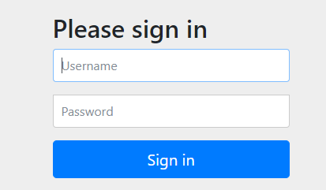

## 覆盖 Spring Boot 自动配置

### 保护应用程序

Spring Boot自动配置让应用程序的安全工作变得易如反掌，只需要添加Security起步依赖。

如果使用Maven，那么你要在项目的 <dependencies> 块中加入如下 <dependency>：

```xml
<dependency>
	<groupId>org.springframework.boot</groupId>
	<artifactId>spring-boot-starter-security</artifactId>
</dependency>
```

在浏览器里打开该应用程序，你马上就会看到HTTP基础身份验证对话框：



此处的用户名是`user`，密码。

密码是在应用程序每次运行时随机生成后写入日志的，你需要查找日志消息（默认写入标准输出）：

```
Using generated security password: a1ac1392-f7d6-4884-a164-1b6cf6c8918c
```

### 创建自定义的安全配置

在Spring Security的场景下，这意味着写一个扩展了 `WebSecurityConfigurerAdapter` 的配置类。

覆盖自动配置的显式安全配置：[SecurityConfig 类](readinglist/src/main/java/com/example/demo/SecurityConfig.java)

通过这个自定义的安全配置类，我们让Spring Boot跳过了安全自动配置，转而使用我们的安全配置。

[Reader 类](readinglist/src/main/java/com/example/demo/Reader.java) 实现了 UserDetails 接口以及其中的方法，这样 Reader 就能代表 Spring Security里的用户了。

