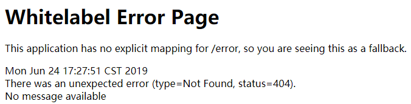
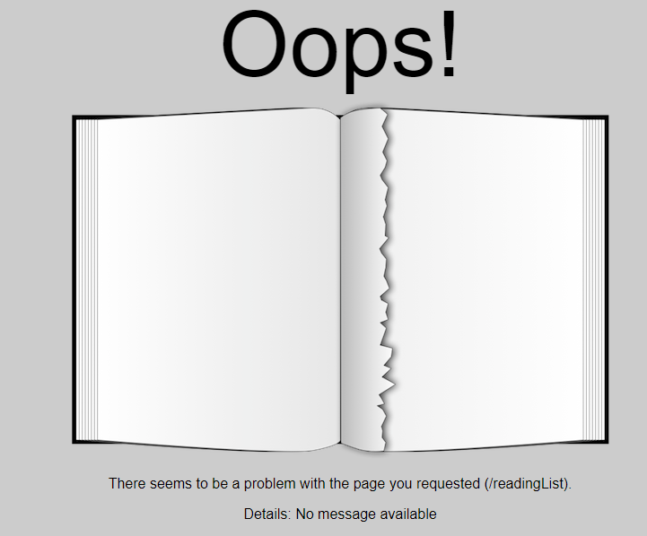

## 定制应用程序错误页面

Spring Boot默认提供这个“白标”（whitelabel）错误页，这是自动配置的一部分。

Spring Boot自动配置的默认错误处理器会查找名为error的视图，如果找不到就用默认的白标
错误视图，如下所示。

因此，最简单的方法就是创建一个自定义视图，让解析出的视图名为 error。

#### 视图解析器

错误视图解析时的视图解析器：

- 实现了Spring的 View 接口的Bean，其 ID为 error （由Spring的 BeanNameViewResolver
  所解析）。
- 如果配置了Thymeleaf，则有名为error.html的Thymeleaf模板。
- 如果配置了FreeMarker，则有名为error.ftl的FreeMarker模板。
- 如果配置了Velocity，则有名为error.vm的Velocity模板。
- 如果是用JSP视图，则有名为error.jsp的JSP模板。

#### 错误属性

默认情况下，Spring Boot会为错误视图提供如下错误属性。

- timestamp ：错误发生的时间。
- status ：HTTP状态码。
- error ：错误原因。
- exception ：异常的类名。
- message ：异常消息（如果这个错误是由异常引起的）。
- errors ： BindingResult 异常里的各种错误（如果这个错误是由异常引起的）。
- trace ：异常跟踪信息（如果这个错误是由异常引起的）。
- path ：错误发生时请求的URL路径。

#### 自定义错误页

[error.html](readinglist/src/main/resources/templates/error.html)

