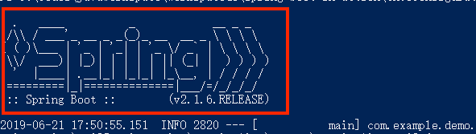

## 自定义 Banner

Spring Boot Banner：



### 自定义 Banner

可以通过在您的类路径中添加一个 banner.txt 文件，或者将banner.location设置到banner文件的位置来更改启动时打印的banner。

Banner 文件：[banner.txt](readinglist/src/main/resources/banner.txt)

```yaml
spring:
  banner:
    location: classpath:banner.txt
```
插入图片，图像将被转换成ASCII艺术表现，并打印在任何文字banner上方
```yaml
spring:
  banner:
    image:
      location: classpath:banner.jpg
```

### 在banner.txt中使用占位符

可以在banner.txt文件中使用以下占位符：

| **变量名**                       | **描述**                                          |
| -------------------------------- | ------------------------------------------------- |
| ${application.version}           | 在MANIFEST.MF中声明的应用程序的版本号。           |
| ${application.formatted-version} | 在MANIFEST.MF中声明的应用程序版本号的格式化显示。 |
| ${spring-boot.version}           | 正在使用的Spring Boot版本。                       |
| ${spring-boot.formatted-version} | 正在使用格式化显示的Spring Boot版本。             |
| ${application.title}             | 应用程序的标题在MANIFEST.MF中声明。               |

### Banner 艺术字生成工具

- [http://patorjk.com/software/taag](http://patorjk.com/software/taag)
- [http://www.network-science.de/ascii/](http://www.network-science.de/ascii/)
- [http://www.degraeve.com/img2txt.php](http://www.degraeve.com/img2txt.php)

