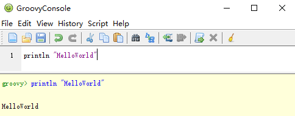
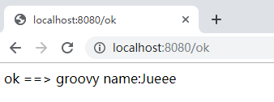

## Groovy 语言入门

### 代码噪声

Java 有一些严格的规则为代码增加
了不少噪声：行尾分号、类和方法的修饰符（比如 public 和 private ）、getter和setter方法，还
有 import 语句。

他们在 Java 中都有自己的作用，但它们同代码的本质无关，因而造成了干扰。

从开发
者的角度来看，代码噪声是阻力——编写代码时是阻力，试图阅读代码时更是阻力。

如果能消除
一部分代码噪声，代码的开发和阅读可以更加方便。

配合 Groovy，Spring Boot CLI 提供了一种开发模型，
消除了几乎所有代码噪声，带来了畅通无阻的开发体验。

### 配置 Groovy 开发环境

官网下载：[https://groovy.apache.org/download.html](https://groovy.apache.org/download.html)

配置环境变量：groovy-2.5.7\bin

查看版本：

```shell
$ groovy -v
Groovy Version: 2.5.7 JVM: 1.8.0_191 Vendor: Oracle Corporation OS: Windows 10
```

启动自带的编辑器：

```shell
$ groovyconsole
```

打印 Hello World，然后按 CTRL + R 运行。



### Groovy 版 Hello World

[HelloWold.groovy](HelloWold.groovy)：

```groovy
@RestController
class MyApp {

    @RequestMapping("/")
    String home() {
        "This is Spring Boot application"
    }
}
```

运行：

```powershell
spring run HelloWold.groovy
```


### 在Spring Boot中使用Groovy

使用在线Spring Boot应用程序生成器 [http://start.spring.io](http://start.spring.io/) 创建应用，并选择Groovy作为编程语言。

以Maven构建工具为例，使用插件：`gmavenplus-plugin`编译Groovy代码：

```xml
<plugin>
	<groupId>org.codehaus.gmavenplus</groupId>
	<artifactId>gmavenplus-plugin</artifactId>
	<version>1.6.3</version>
	<executions>
		<execution>
			<goals>
				<goal>addSources</goal>
				<goal>addTestSources</goal>
				<goal>generateStubs</goal>
				<goal>compile</goal>
				<goal>generateTestStubs</goal>
				<goal>compileTests</goal>
				<goal>removeStubs</goal>
				<goal>removeTestStubs</goal>
			</goals>
		</execution>
	</executions>
</plugin>
```

**第一步**，创建示例类[Man.groovy](demo/src/main/groovy/com/example/demo/Man.groovy)

**第二步**，创建一个查询服务，包含一个接口类[ManService.groovy](demo/src/main/groovy/com/example/demo/ManService.groovy)和一个实现类[ManServiceImpl.groovy](demo/src/main/groovy/com/example/demo/ManServiceImpl.groovy)

**第三步**，创建一个Rest API控制器[ManController.groovy](demo/src/main/groovy/com/example/demo/ManController.groovy)

**最后一步**，创建Boot启动类[RunAppGroovy.groovy](demo/src/main/groovy/com/example/demo/DemoApplication)

启动，成功！访问<http://localhost:8080/ok>：



