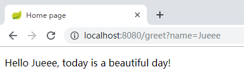

## Groovy 语言入门

### 代码噪声

Java 有一些严格的规则为代码增加
了不少噪声：行尾分号、类和方法的修饰符（比如 public 和 private ）、getter和setter方法，还
有 import 语句。

他们在 Java 中都有自己的作用，但它们同代码的本质无关，因而造成了干扰。

从开发
者的角度来看，代码噪声是阻力——编写代码时是阻力，试图阅读代码时更是阻力。

如果能消除
一部分代码噪声，代码的开发和阅读可以更加方便。

配合 Groovy，Spring Boot CLI 提供了一种开发模型，
消除了几乎所有代码噪声，带来了畅通无阻的开发体验。

### Groovy 版 Hello World

[HelloWold.groovy](HelloWold.groovy)：

```groovy
@RestController
class MyApp {

    @RequestMapping("/")
    String home() {
        "This is Spring Boot application"
    }
}
```

运行：

```powershell
spring run HelloWold.groovy
```


### 设置 CLI 项目

Spring
Boot CLI 项目并没有严格的项目结构要求。

实际上，最简单的 Spring Boot CLI 应用程序就是一个
Groovy 脚本，可以放在文件系统的任意目录里。

创建一个干净
的新目录来存放代码：

```shell
$ mkdir helloGroovy
$ cd helloGroovy
$ mkdir static	# 存放静态Web内容
$ mkdir templates	# 存放Thymeleaf模板
```

Spring Boot 会自动配置一个Spring ResourceHttpRequestHandler 查找static目录（还有其他位置）的静态内容。还会配置Thymeleaf来解析
templates目录里的模板。

目录结构：

```powershell
├─static
│      index.html
└─templates
       hello.ftl
```

程序入口：[App.groovy](helloGroovy/app.groovy)

运行：

```
spring run app.groovy
```




### Spring Boot CLI 的技能

- CLI 可以利用 Spring Boot 的自动配置和起步依赖。
- CLI 可以检测到正在使用的特定类，自动解析合适的依赖库来支持那些类。
- CLI 知道多数常用类都在哪些包里，如果用到了这些类，它会把那些包加入Groovy的默认包里。
- 应用自动依赖解析和自动配置后，CLI 可以检测到当前运行的是一个Web应用程序，并自动引入嵌入式 Web 容器（默认是Tomcat）供应用程序使用。

