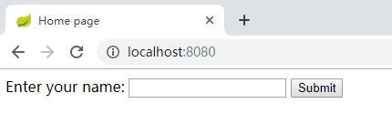
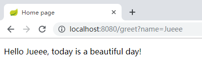
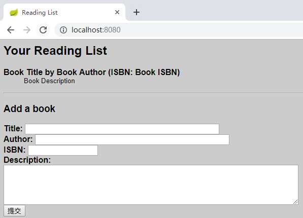

## 开发 Spring Boot Cli 应用程序

### Spring Boot CLI 的技能

- CLI 可以利用 Spring Boot 的自动配置和起步依赖。
- CLI 可以检测到正在使用的特定类，自动解析合适的依赖库来支持那些类。
- CLI 知道多数常用类都在哪些包里，如果用到了这些类，它会把那些包加入Groovy的默认包里。
- 应用自动依赖解析和自动配置后，CLI 可以检测到当前运行的是一个Web应用程序，并自动引入嵌入式 Web 容器（默认是Tomcat）供应用程序使用。

### 设置 CLI 项目

Spring
Boot CLI 项目并没有严格的项目结构要求。

实际上，最简单的 Spring Boot CLI 应用程序就是一个
Groovy 脚本，可以放在文件系统的任意目录里。

创建一个干净
的新目录来存放代码：

```shell
$ mkdir helloGroovy
$ cd helloGroovy
$ mkdir static	# 存放静态Web内容
$ mkdir templates	# 存放Thymeleaf模板
```

Spring Boot 会自动配置一个Spring ResourceHttpRequestHandler 查找static目录（还有其他位置）的静态内容。还会配置Thymeleaf来解析
templates目录里的模板。

目录结构：

```powershell
├─static
│      index.html
└─templates
       hello.ftl
```

程序入口：[App.groovy](helloGroovy/app.groovy)

运行：

```
spring run app.groovy
```





### 使用 Groovy 语言重写阅读列表应用程序

#### 设置 CLI 项目

创建一个干净
的新目录来存放代码：

```shell
$ mkdir readinglist
$ cd readinglist
$ mkdir static	# 存放静态Web内容
$ mkdir templates	# 存放Thymeleaf模板
```

Spring Boot 会自动配置一个Spring ResourceHttpRequestHandler 查找static目录（还有其他位置）的静态内容。还会配置Thymeleaf来解析
templates目录里的模板。

把 style.css 复制到 static 目录，把 readingList.html 复制到
templates 目录。

目录结构：

```powershell
├─static
│      style.css
└─templates
       readingList.html
```

#### 通过 Groovy 消除代码噪声

#####  领域类 [Book.groovy](readinglist/Book.groovy)

Groovy类与它的Java类相比，这里没有setter和getter方
法，没有 public 和 private 修饰符，也没有分号。

##### 接口 [ReadingListRepository.groovy](readinglist/ReadingListRepository.groovy)

除了没有分号，以及接口上没有 public 修饰符，Groovy版本
和与之对应的Java版本并无二致。

- 在 findByReader() 里，调用 query() 时可以在需要 RowMapper 实现的地方传入一个Groovy闭
  包。
- 闭包中创建了一个新的 Book 对象，在构造时设置对象的属性。

##### 数据库 [schema.sql](readinglist/schema.sql)

包含创建 Book 表所需的SQL。

##### 控制器 [ReadingListController.groovy](readinglist/ReadingListController.groovy)

##### 依赖 [Grabs.groovy](readinglist/Grabs.groovy)

将 @Grab 注解放在  [ReadingListController](readinglist/ReadingListController.groovy)或  [JdbcReadingListRepository](readinglist/JdbcReadingListRepository.groovy) 同样有效。

不过，为了便于组织管理，最好创建一个空类，把所有 @Grab 注解放在一起。

这样方便在一个地方看到所有显式声明的依赖。

#### 运行程序

```
spring run *.groovy
```

#### 访问程序

[http://localhost:8080](http://localhost:8080/)：



