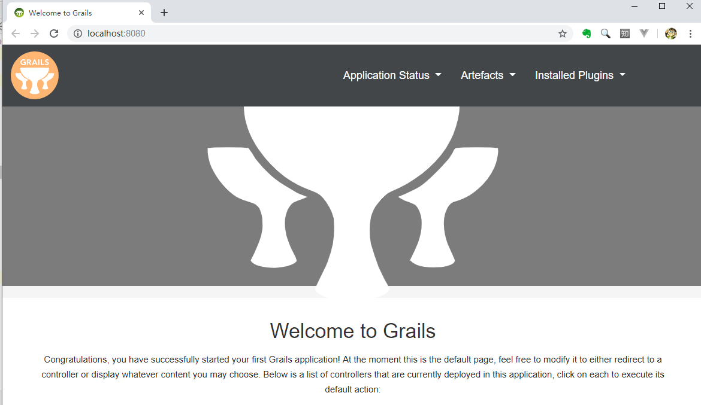
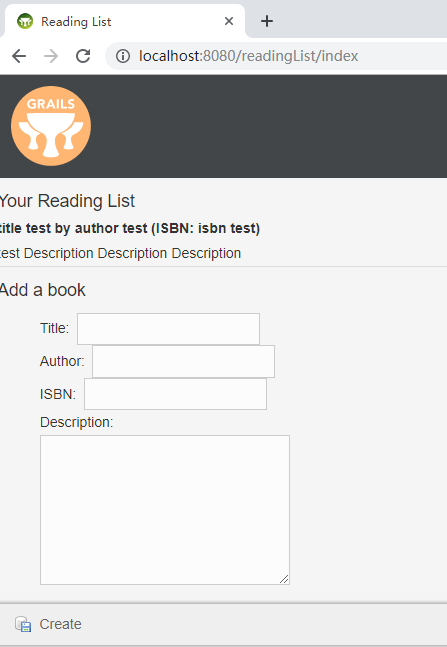

## 结合 Spring Boot 与 Grails 3

#### 创建新的 Grails 项目

要创建阅读列表项目，可以这样使用 grails 命令：

```
grails create-app readinggrails
```

#### 运行Grails应用程序

```
grails run-app
```
Gradle引入了 bootRun 任务
```
gradle bootRun
```

运行生成的可执行JAR文件：

```shell
$ gradle build
$ java -jar build/lib/readingList-0.1.jar
```

就算一行代码都还没写，我们也能运行应用程序，在浏览器里进行访问：



#### 定义领域模型

```shell
$ grails create-domain-class Book
| Created grails-app/domain/readinggrails/Book.groovy
| Created src/test/groovy/readinggrails/BookSpec.groovy
```

代码：[Book.groovy](readinggrails/grails-app/domain/readinggrails/Book.groovy)

#### 开发 Grails 控制器

```
grails create-controller ReadingList
| Created grails-app/controllers/readinggrails/ReadingListController.groovy
| Created src/test/groovy/readinggrails/ReadingListControllerSpec.groovy
```

- create-controller ：创建空控制器，让开发者来编写控制器的功能。
- generate-controller ：生成一个控制器，其中包含特定领域模型类的基本CRUD操作。
- generate-all ：生成针对特定领域模型类的基本CRUD控制器，及其视图。

代码：[ReadingListController.groovy](readinggrails/grails-app/controllers/readinggrails/ReadingListController.groovy)

```groovy
package readinggrails

import grails.gorm.transactions.Transactional

class ReadingListController {

    def index() {
        // 获取图书填充到模型里
        respond Book.list(params), model:[book: new Book()]
    }

    // 保存图书
    @Transactional
    def save(Book book) {
        book.reader = 'Craig'
        book.save flush:true
        redirect(action: "index")
    }
}
```

#### 创建视图

Grails应用程序通常都用GSP模板来做视图。

代码：[index.gsp](readinggrails/grails-app/views/readingList/index.gsp)

#### 运行程序

