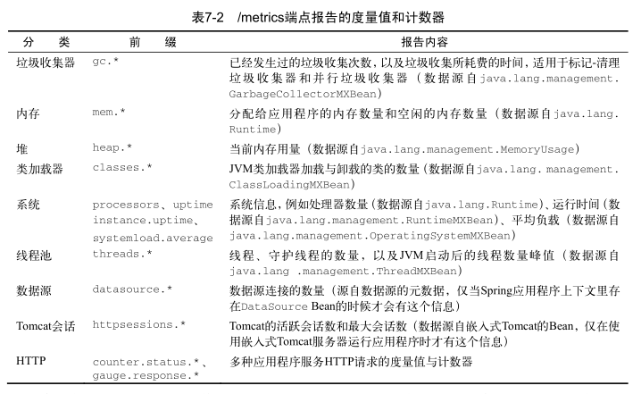
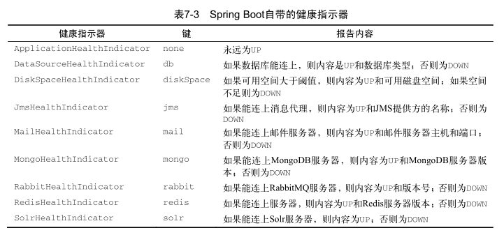

## 揭秘 Actuator 的端点

Spring Boot Actuator的关键特性是在应用程序里提供众多Web端点，通过它们了解应用程序
运行时的内部状况。

有了Actuator：

- 可以知道Bean在Spring应用程序上下文里是如何组装在一
  起的
- 掌握应用程序可以获取的环境属性信息
- 获取运行时度量信息的快照……

### 引入Actuator

引入Actuator的起步依赖：

```xml
<dependency>
	<groupId>org.springframework.boot</groupId>
	<artifactId>spring-boot-starter-actuator</artifactId>
</dependency>
```

Gradle构建：

```groovy
compile 'org.springframework.boot:spring-boot-starter-actuator'
```

使用Spring Boot CLI，可以使用如下 @Grab 注解：

```java
@Grab('spring-boot-starter-actuator')
```

#### 配置信息

```properties
# Spring Actuator Endpoints 默认关闭，需要打开
endpoints.enabled=true
# close security. 关闭身份验证，否则无法查询出数据
management.security.enabled=false
```

### Actuator的端点

[官方文档](https://docs.spring.io/spring-boot/docs/current/reference/html/production-ready-endpoints.html)

| HTTP 方法 | 路径            | 描述                                                         |
| --------- | --------------- | ------------------------------------------------------------ |
| GET       | /auditevents    | 显示应用暴露的审计事件 (比如认证进入、订单失败)              |
| GET       | /beans          | 描述应用程序上下文里全部的 Bean，以及它们的关系              |
| GET       | /conditions     | 提供一份自动配置生效的条件情况，记录哪些自动配置条件通过了   |
| GET       | /configprops    | 描述配置属性(包含默认值)如何注入Bean                         |
| GET       | /env            | 获取全部环境属性                                             |
| GET       | /env/{name}     | 根据名称获取特定的环境属性值                                 |
| GET       | /flyway         | 提供一份 Flyway 数据库迁移信息                               |
| GET       | /liquidbase     | 显示Liquibase 数据库迁移的纤细信息                           |
| GET       | /health         | 报告应用程序的健康指标，这些值由 HealthIndicator 的实现类提供 |
| GET       | /heapdump       | dump 一份应用的 JVM 堆信息                                   |
| GET       | /httptrace      | 显示HTTP足迹，最近100个HTTP request/repsponse                |
| GET       | /info           | 获取应用程序的定制信息，这些信息由info打头的属性提供         |
| GET       | /logfile        | 返回log file中的内容(如果 logging.file 或者 logging.path 被设置) |
| GET       | /loggers        | 显示和修改配置的loggers                                      |
| GET       | /metrics        | 报告各种应用程序度量信息，比如内存用量和HTTP请求计数         |
| GET       | /metrics/{name} | 报告指定名称的应用程序度量值                                 |
| GET       | /scheduledtasks | 展示应用中的定时任务信息                                     |
| GET       | /sessions       | 如果我们使用了 Spring Session 展示应用中的 HTTP sessions 信息 |
| POST      | /shutdown       | 关闭应用程序，要求endpoints.shutdown.enabled设置为true       |
| GET       | /mappings       | 描述全部的 URI路径，以及它们和控制器(包含Actuator端点)的映射关系 |
| GET       | /threaddump     | 获取线程活动的快照                                           |

### 查看配置明细

Actuator有一些端点不仅可以显示组件映射关系，还可以告诉你自动配置在配置
Spring应用程序上下文时做了哪些决策。

#### 获得Bean装配报告：/beans

要了解应用程序中Spring上下文的情况，最重要的端点就是`/beans`：[http://localhost:8080/beans](http://localhost:8080/beans)。

它会返回一个JSON文档，
描述上下文里每个Bean的情况，包括其Java类型以及注入的其他Bean。

所有的Bean条目都有五类信息：

- bean ：Spring应用程序上下文中的Bean名称或ID。
- resource ：.class文件的物理位置，通常是一个URL，指向构建出的JAR文件。这会随着
  应用程序的构建和运行方式发生变化。
- dependencies ：当前Bean注入的Bean ID列表。
- scope ：Bean的作用域（通常是单例，这也是默认作用域）。
- type ：Bean的Java类型。

#### 详解自动配置：/autoconfig

`/autoconfig` 端点能告诉为什么会有这个Bean，或者为什么没有这个Bean。

`/autoconfig` 端点提供了
一个报告，列出了计算过的所有条件，根据条件是否通过进行分组。

- 在 positiveMatches 里，你会看到一个条件，决定Spring Boot是否自动配置 Bean。
- 在 negativeMatches 里，有一个条件决定了是否要配置 Bean。

#### 查看配置属性：/env

`/env` 端点会生成应用程序可用的所有环境属性的列表，无论这些属性是否用到。

这其中包括
环境变量、JVM属性、命令行参数，以及applicaition.properties或application.yml文件提供的属性。

/env端点还能用来获取单个属性的值，只需要在请求时在/env后加上属性名即可。

```shell
$ curl 'http://localhost:8080/env/local.server.port'
{"local.server.port":8080}
```

#### 生成端点到控制器的映射：/mappings

`/mappings` 端点就提供了一个列表，罗列出了应用程序发布的全部端点。

### 运行时度量

Actuator
提供了一系列端点，让你能在运行时快速检查应用程序。

#### 查看应用程序的度量值：/metrics

/metrics端点提供了很多信息：



/metrics端点会返回所有的可用度量值。要获取单个值，请
求时可以在URL后加上对应的键名。

```shell
# 查看空闲内存大小
$ curl 'http://localhost:8080/metrics/mem.free'
{"mem.free":526667}
```

#### 追踪Web请求：/trace

/trace端点能报告所有Web请求的详细信息，包括请求方法、路径、时间戳以及请求和响应的头信息。

/trace端点实际能显示最近100个请求的信息，包
含对/trace自己的请求。

```json
{
    "timestamp": 1562555495073, 
    "info": {
        "method": "GET", 
        "path": "/metrics/mem.free", 
        "headers": {
            "request": {
                "host": "localhost:8080", 
                "connection": "keep-alive", 
                "upgrade-insecure-requests": "1", 
                "user-agent": "Mozilla/5.0 (Windows NT 10.0; Win64; x64) AppleWebKit/537.36 (KHTML, like Gecko) Chrome/75.0.3770.100 Safari/537.36", 
                "accept": "text/html,application/xhtml+xml,application/xml;q=0.9,image/webp,image/apng,*/*;q=0.8,application/signed-exchange;v=b3", 
                "accept-encoding": "gzip, deflate, br", 
                "accept-language": "zh-CN,zh;q=0.9,zh-HK;q=0.8,zh-TW;q=0.7,en;q=0.6"
            }, 
            "response": {
                "X-Application-Context": "application:development", 
                "Content-Disposition": "inline;filename=f.txt", 
                "Content-Type": "application/vnd.spring-boot.actuator.v1+json;charset=UTF-8", 
                "Transfer-Encoding": "chunked", 
                "Date": "Mon, 08 Jul 2019 03:11:35 GMT", 
                "status": "200"
            }
        }, 
        "timeTaken": "17"
    }
}
```

#### 导出线程活动：/dump

/dump端点会生成当前线程活动的快照。
完整的线程导出报告里会包含应用程序的每个线程。

#### 监控应用程序健康情况：/health

如果你想知道自己的应用程序是否在运行，可以直接访问/health端点。

```shell
$ curl 'http://localhost:8080/health'
{"status":"UP","diskSpace":{"status":"UP","total":254553292800,"free":141066600448,"threshold":10485760}}
```

/health端点所提供的所有信息都是由一个或多个健康指示器提供的。



### 关闭应用程序：/shutdown

为了关闭应用程序，你要往/shutdown发送一个 POST 请求。

```shell
$ curl -X POST 'http://localhost:8080/shutdown'
{"message":"This endpoint is disabled"}
```

这个端点默认是关闭的。

要开启该端点，可以将 endpoints.shutdown.enabled 设置为 true 。

```yaml
endpoints:
  shutdown:
    enabled: true
```

### 获取应用信息：/info

/info端点能展示各种你希望发布的应用信息。

对该端点的 GET 请求的默认响应是这样的：

```shell
$ curl 'http://localhost:8080/info'
{}
```

可以在application.yml里
可以配置如下属性：

```yaml
info:
    app:
        name: '@info.app.name@'
        version: '@info.app.version@'
        grailsVersion: '@info.app.grailsVersion@'
```

/info端点返回的 JSON 会包含一个 app 属性

```shell
$ curl 'http://localhost:8080/info'
{"app":{"grailsVersion":"3.3.10","version":"0.1","name":"readinggrails"}}
```

