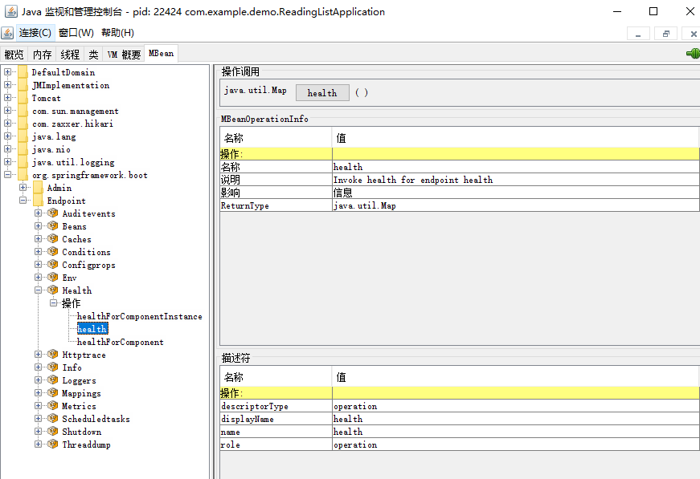

## 通过 JMX 监控应用程序

Actuator 把它的端点以 MBean 的方式发布了出来，可以通过
 JMX 来查看和管理。

Actuator 的端点都发布在org.springframework.boot域下。

通过JConsole查看请求映射端点。

可以在 JDK 安装路径下的 bin 目录中找到它（jconsole.exe）。

有 6 个选项卡：

- Overview：
  该选项卡展示了有关该应用程序的一般信息。
- Memory：
  该选项卡展示了有关内存使用情况的信息。
- Threads：
  该选项卡展示了应用程序的线程随时间推移的演变情况，而且允许查看某一线程的详细信息。
- Classes：
  该选项卡展示了当前加载类的信息以及类的数量。
- VM Summary：
  该选项卡展示了运行进程的 Java 虚拟机的信息。
- MBean：
  该选项卡展示了进程的 MBean。
  Mbean 是一个托管的 Java 对象，可以表示设备、应用程序或者任何资源，而且它是 JMX API 的基础。

