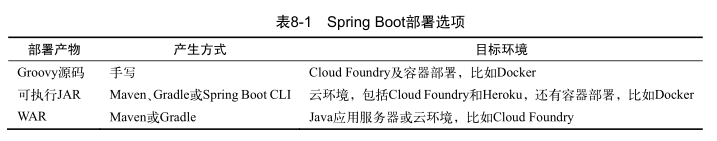

## 衡量多种部署方式

#### 运行正在开发的应用程序

构建和运行正在开发的 Spring Boot 应用程序有多种方式：

- 在 IDE 中运行应用程序（涉及Spring ToolSuite或 IntelliJ IDEA）。
- 使用Maven的 `spring-boot:run` 或Gradle的 `bootRun` ，在命令行里运行。
- 使用Maven或Gradle生成可运行的JAR文件，随后在命令行中运行。
- 使用Spring Boot CLI在命令行中运行Groovy脚本。
- 使用Spring Boot CLI来生成可运行的JAR文件，随后在命令行中运行。

#### 将应用部署于非开发环境

Spring Boot应用程序可以用多种方式打包。

