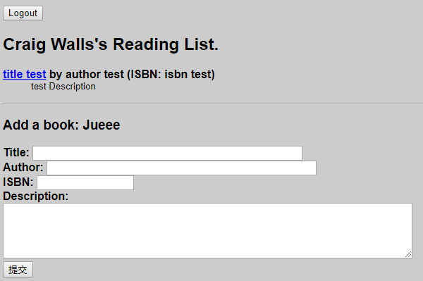
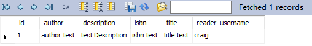
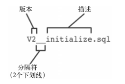
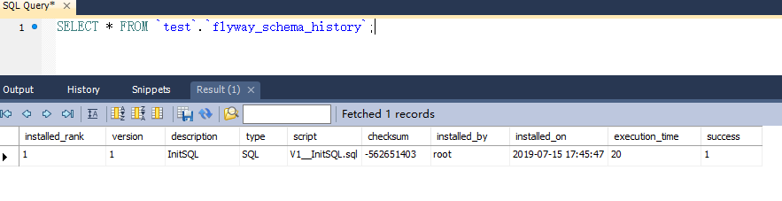
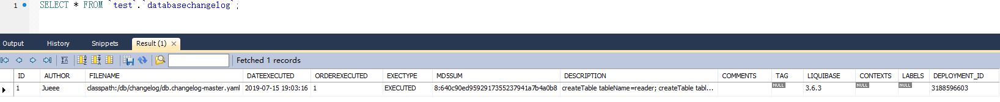
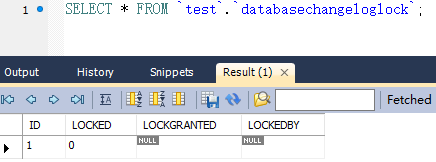

# 向 Java 应用服务器里部署 WAR 文件

到目前为止，阅读列表应用程序每次运行，Web应用程序都通过内嵌在应用里的Tomcat提供
服务。

情况和传统 Java Web 应用程序正好相反。不是应用程序部署在Tomcat里，而是Tomcat部署在了应用程序里。

归功于 Spring Boot 的自动配置功能，我们不需要创建 `web.xml` 文件或者Servlet初始化类来声明 Spring MVC 的 `DispatcherServlet` 。

但如果要将应用程序部署到Java应用服务器里，我们就需
要构建WAR文件了。

这样应用服务器才能知道如何运行应用程序。

那个 WAR 文件里还需要一个对 Servlet 进行初始化的东西。

## 构建 WAR 文件

### 使用Gradle来构建应用程序

#### 配置 build.gradle

应用 WAR 插件：

```groovy
apply plugin: 'war'
```

在build.gradle里用以下 war 配置替换原来的 jar 配置：

```groovy
war {
	baseName = 'readinglist'
	version = 'ch08'
}
```

#### 构建应用程序

只需调用 build 任务即可：

```
$ gradle build
```

成功构建之后，可以在 build/libs 里看到一个名为 `readinglist-ch08.war` 的文件。

### 使用Maven构建项目

#### 配置 pom.xml

只需把 `<packaging>` 元素的值从 jar
改为 war 。

```xml
<packaging>war</packaging>
```

这样就能生成WAR文件了。

但如果WAR文件里没有启用Spring MVC DispatcherServlet
的web.xml文件或者Servlet初始化类，这个WAR文件就一无是处。

#### 对 Servlet 进行初始化

Spring Boot 提供的 `SpringBootServletInitializer` 是一个支持
Spring Boot 的 Spring `WebApplicationInitializer` 实现。

除了配置Spring的 `DispatcherServlet` ， `SpringBootServletInitializer` 还会在Spring应用程序上下文里查找 `Filter` 、
`Servlet` 或 `ServletContextInitializer` 类型的Bean，把它们绑定到Servlet容器里。

要使用 `SpringBootServletInitializer` ，只需创建一个子类，覆盖 configure() 方法来指定Spring配置类。

**代码**：[ReadingListServletInitializer.java](readinglist_war/src/main/java/com/example/demo/ReadingListServletInitializer.java)

```java
public class ReadingListServletInitializer extends SpringBootServletInitializer{
    
    @Override
    protected SpringApplicationBuilder configure(SpringApplicationBuilder builder) {
        // ReadingListApplication 类上添加了 @SpringBootApplication 注解。
        // 这会隐性开启组件扫描，而组件扫描则会发现并应用其他配置类。
        return builder.sources(ReadingListApplication.class);
    }
}
```

#### 构建应用程序

只需使用 package 即可：

```
$ mvn clean package
```

成功构建之后，可以在 target 里看到一个名为 `readinglist-ch08.war` 的文件。

### 部署 Tomcat

可以把WAR文件复制到Tomcat的webapps目录里。

用你的浏览器打开 [http://127.0.0.1:8080/readinglist-ch08/](http://127.0.0.1:8080/readinglist-ch08/) 就能访问应用程序了。

若访问 http://localhost:8080/readinglist-ch08/login，则会报错：

```
org.springframework.security.web.firewall.RequestRejectedException: The request was rejected because the URL contained a potentially malicious String ";"
        at org.springframework.security.web.firewall.StrictHttpFirewall.rejectedBlacklistedUrls(StrictHttpFirewall.java:325) ~[spring-security-web-5.1.5.RELEASE.jar:5.1.5.RELEASE]
        at org.springframework.security.web.firewall.StrictHttpFirewall.getFirewalledRequest(StrictHttpFirewall.java:293) ~[spring-security-web-5.1.5.RELEASE.jar:5.1.5.RELEASE]
        at org.springframework.security.web.FilterChainProxy.doFilterInternal(FilterChainProxy.java:194) ~[spring-security-web-5.1.5.RELEASE.jar:5.1.5.RELEASE]
        at org.springframework.security.web.FilterChainProxy.doFilter(FilterChainProxy.java:178) ~[spring-security-web-5.1.5.RELEASE.jar:5.1.5.RELEASE]
        at org.springframework.web.filter.DelegatingFilterProxy.invokeDelegate(DelegatingFilterProxy.java:357) ~[spring-web-5.1.8.RELEASE.jar:5.1.8.RELEASE]
```

### 直接运行 Jar

如果你没有删除 Application 里的 main() 方法，构建过程生成的WAR文件仍可直接运行：

```
$ java -jar readinglist-ch08.war
```

访问：https://localhost:8443/

## 创建生产 Profile

通过自动配置，我们有了一个指向嵌入式H2数据库的 DataSource Bean。

更确切地说，
DataSource Bean是一个数据库连接池，通常是 `org.apache.tomcat.jdbc.pool.DataSource` 。

要使用嵌入式H2之外的数据库，我们只需声明自己的 DataSource Bean，指向我们选择的生产数据库，用它覆盖自动配置的 DataSource Bean。

我们现在要设置属性，让 DataSource Bean指向 MySQL 而非内嵌的H2数据库。

具体来说，我们要设置的是 `spring.datasource.url` 、 `spring.datasource.username` 以及
`spring.datasource.password` 属性。

```yaml
spring:
  profiles: production
  datasource:
    url: jdbc:mysql://127.0.0.1:3306/test
    username: root
    password: jue
```

配置属性

```properties
#`hibernate_sequence' doesn't exist
spring.jpa.hibernate.use-new-id-generator-mappings=false

# 指定DDL mode (none, validate, update, create, create-drop). 当使用内嵌数据库时，默认是create-drop，否则为none.
spring.jpa.hibernate.ddl-auto=create
```

若报错：

```
Table 'test.hibernate_sequence' doesn't exist

配置：spring.jpa.hibernate.use-new-id-generator-mappings=false
```

将自动创建 MySQL 表：

```mysql
delimiter $$

CREATE TABLE `reader` (
  `username` varchar(255) NOT NULL,
  `fullname` varchar(255) DEFAULT NULL,
  `password` varchar(255) DEFAULT NULL,
  `role` varchar(255) DEFAULT NULL,
  PRIMARY KEY (`username`)
) ENGINE=MyISAM DEFAULT CHARSET=latin1$$

delimiter $$

CREATE TABLE `book` (
  `id` bigint(20) NOT NULL AUTO_INCREMENT,
  `author` varchar(255) DEFAULT NULL,
  `description` varchar(255) DEFAULT NULL,
  `isbn` varchar(255) DEFAULT NULL,
  `title` varchar(255) DEFAULT NULL,
  `reader_username` varchar(255) DEFAULT NULL,
  PRIMARY KEY (`id`),
  KEY `FKs18x37wsirnegkj90wnxwdg0g` (`reader_username`)
) ENGINE=MyISAM AUTO_INCREMENT=2 DEFAULT CHARSET=latin1$$
```

向 reader 表插入一条用户：

```mysql
INSERT INTO `test`.`reader` (`username`, `fullname`, `password`, `role`) 
VALUES ('craig', 'Craig Walls', '$2a$10$usGif1C5fxfqGNyGrIKvbOP6TX554s7qxPhJuwOOIzVptwFvqBDgS', 'ROLE_READER');
```

登录并插入一条书籍记录后，会将 book 书籍存入 book 表：





【注】此时，应用程序每次重启数据库，Schema就会被清空，从头开始重建。

### 开启 Profile

###### 方法一：修改配置文件

```properties
spring.profiles.active=production
```

###### 方法二：设置环境变量

在运行应用服务器的机器上设置一个系统环境变量：

```shell
export SPRING_PROFILES_ACTIVE=production
```

## 开启数据库迁移

### 方法一：设置属性

一种途径是通过Spring Boot的 `spring.jpa.hibernate.ddl-auto` 属性将 `hibernate.
hbm2ddl.auto` 属性设置为 `create` 、 `create-drop` 或`update` 。

我们可以在application.yml里加入如下内容：

```yaml
spring:
  jpa:
    hibernate:
      ddl-auto: create-drop
```

然而，这对生产环境来说并不理想，因为应用程序每次重启数据库，Schema就会被清空，从
头开始重建。

它可以设置为 update ，但就算这样，我们也不建议将其用于生产环境。

### 方法二：定义Schema

可以在schema.sql里定义Schema。

在第一次运行时，这么做没有问题，
但随后每次启动应用程序时，这个初始化脚本都会失败，因为数据表已经存在了。

这就要求在书写初始化脚本时格外注意，不要重复执行那些已经做过的工作。

### 方法三：使用数据库迁移库

数据库迁移库（`database migration library`）使用一系列数据库脚本，而且会记录哪些已经用过了，不会多次运用同一个脚本。

应用程序的每个部署包里都包含了
这些脚本，数据库可以和应用程序保持一致。

Spring Boot为两款流行的数据库迁移库提供了自动配置支持：

- Flyway（http://flywaydb.org）
- Liquibase（http://www.liquibase.org）

当你想要在Spring Boot里使用其中某一个库时，只需在项目里加入对应的依赖，然后编写脚本就可以了。

#### 用 Flyway 定义数据库迁移过程

Flyway是一个非常简单的开源数据库迁移库，使用SQL来定义迁移脚本。

它的理念是，每个
脚本都有一个版本号，Flyway会顺序执行这些脚本，让数据库达到期望的状态。

它也会记录已执
行的脚本状态，不会重复执行。

##### 添加Flyway依赖

Spring Boot 2.x 对 flyway 的依赖为 5.x ，旧的 api 已经不支持：

```xml
<dependency>
	<groupId>org.flywayfb</groupId>
	<artifactId>flyway-core</artifactId>
    <version>5.2.4</version>
</dependency>
```

##### 脚本路径

Flyway脚本需要放在相对于应用程序 Classpath 根路径的 `/db/migration` 路径下。

因此，项目中，
脚本需要放在 `src/main/resources/db/migration` 里。

##### 命名脚本

Flyway 脚本就是SQL。让其发挥作用的是其在Classpath里的位置和文件名。

Flyway
脚本都遵循一个命名规范，含有版本号，具体如下所示：



所有Flyway脚本的名字都以大写字母V开头，随后是脚本的版本号。后面跟着两个下划线和对脚本的描述。

描述可以很灵活，
主要用来帮助理解脚本的用途。

如 ：[V1__InitSQL.sql](readinglist_war/src/main/resources/db/migration/V1__InitSQL.sql)

##### 修改配置

还需要将 spring.jpa.hibernate.ddl-auto 设置为 none ，由此告知Hibernate不要创建数据表。

```properties
spring.jpa.hibernate.ddl-auto=none
```

##### 部署运行

在应用程序部署并运行起来后，Spring Boot会检测到Classpath里的Flyway，自动配置所需的
Bean。

Flyway会依次查看 `/db/migration` 里的脚本，如果没有执行过就运行这些脚本。

每个脚本都
执行过后，向 schema_version 表里写一条记录。

应用程序下次启动时，Flyway会先看 schema_version
里的记录，跳过那些脚本。

schema_version 表如下：



#### 用Liquibase定义数据库迁移过程

Flyway 用起来很简便，在Spring Boot自动配置的帮助下尤其如此。

但是，使用SQL来定义迁移脚本是一把双刃剑。

SQL用起来便捷顺手，却要冒着只能在一个数据库平台上使用的风险。

Liquibase并不局限于特定平台的SQL，可以用多种格式书写迁移脚本，不用关心底层平台（其
中包括XML、YAML和JSON）。如果你有这个期望的话，Liquibase当然也支持SQL脚本。

##### 引入Liquibase依赖

```xml
<dependency>
	<groupId>org.liquibase</groupId>
	<artifactId>liquibase-core</artifactId>
</dependency>
```

##### 配置脚本

默认情况
下，Liquibase 会在 `/db/changelog`（相对于Classpath根目录）里查找`db.changelog-master.yaml`文件。

Liquibase 变更集都集中在一
个文件里：[db.changelog-master.yaml](readinglist_war/src/main/resources/db/changelog/db.changelog-master.yaml)

##### 设置属性

这里的例子使用的是YAML格式，但你也可以任意选择Liquibase所支持的其他格式，比
如XML或JSON。

只需在 application.yml 简单地设置 `liquibase.change-log` 属性，标明希望Liquibase加载的文件即可。

```yaml
liquibase:
  change-log: classpath:/db/changelog/db.changelog-master.xml
```

##### 部署运行

应用程序启动时，Liquibase 会读取`db.changelog-master.yaml`里的变更集指令集，与之前写入
databaseChangeLog 表里的内容做对比，随后执行未运行过的变更集。





