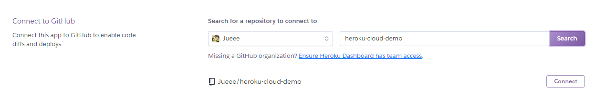

## 推上云端：部署到 Heroku

Heroku为你的应用程序安排了一个Git仓库。

每当你向仓库里提交代码时，它都会自动为你构建并部署应用程序。

#### 注册 Heroku

[https://www.heroku.com/](https://www.heroku.com/)

#### 下载客户端

[https://devcenter.heroku.com/articles/heroku-cli#download-and-install](https://devcenter.heroku.com/articles/heroku-cli#download-and-install)

查看版本：

```shell
$ heroku --version
heroku/7.26.2 win32-x64 node-v11.14.0
```


#### 设置应用程序

使用 apps:create 命令：

```
heroku apps:create test-readinglist
```

apps:create 命令会在 https://git.heroku.com/test-readinglist.git 创建一个远程Git仓库，并在本
地项目的Git配置里添加一个名为heroku的远程仓库引用。这样就能通过 git 命令将项目推送到
Heroku了。

#### 配置文件

Heroku需要你提供一个名为
Procfile 的文件，告诉Heroku应用程序构建后该如何运行。

对于阅读列表应用程序而言，我们需要
告诉Heroku，构建生成的WAR文件要当作可执行JAR文件来运行，这里使用 java 命令。

使用Maven来构建项目：

```
web: java -Dserver.port=$PORT -jar target/readinglist.war
```

不管何种情况，你都需要像例子中那样设置 server.port 属性。

这样内嵌的Tomcat服务器
才能在Heroku分配的端口上（通过 $PORT 变量指定）启动。

#### 设置Java版本

还需要告诉Heroku用什么Java版本来构建并运行应用程序。这样Heroku才能用合适的版本
来运行它。

最简单的方法是在项目根目录里创一个名为 `system.properties` 的文件，在其中设置
`java.runtime.version` 属性：

```
java.runtime.version=1.8
```

#### 推上Heroku

只需将代码推到远程Git仓库，Heroku会
帮我们搞定其他事情。

```
$ git commit -am "Initial commit"
$ git push heroku master
```

Heroku会根据找到的构建说明文件，使用Maven或Gradle进行构建，再用 Procfile
里的指令来运行应用程序。

就绪后，你可以用浏览器打开`http://{app name}.herokuapp.com`，这里的`{app name}`就是你在 `apps:create` 里给应用程序起的名字。

例如，我在部署时将应用程序命名为 test-readinglist，所以它的URL就是http://test-readinglist. herokuapps.com。

#### 关联 GitHub

